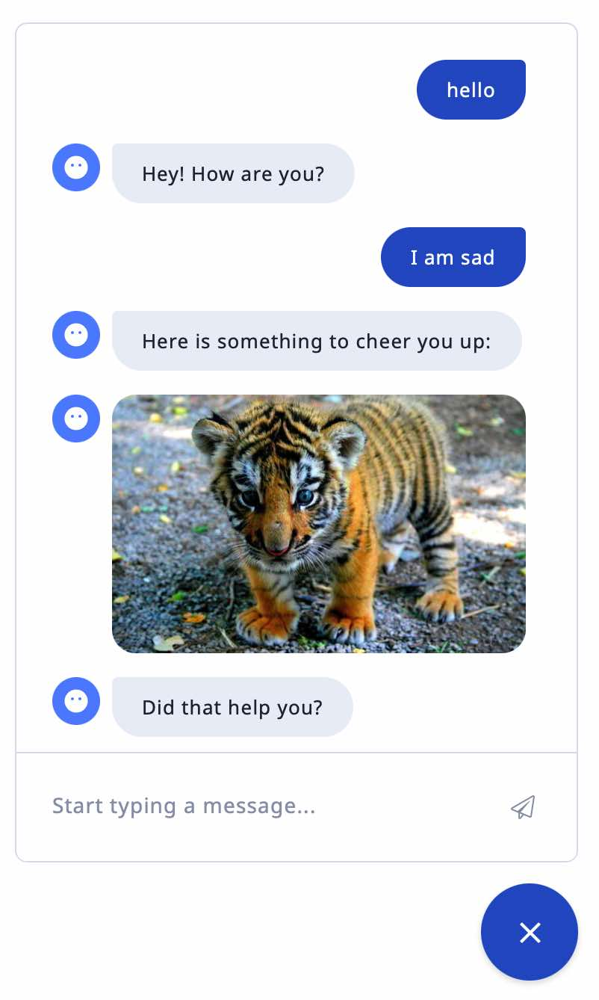

# Introduction to RASA 
## or RASA for the dummy (me...)

This document relates my experience with the installation of [RASA Open Source (3.0)](https://rasa.com/docs/rasa/). 
As this turned out to be quite an endeavour, I decided to keep track of the good and bad tries that finally lead to 
a working system.  I initially found the documentation quite hard to follow, it seems to have been designed for being used as a reference for experienced users. Many tutorials are either copies of the official RASA documentation or long YouTube videos. 

It also turned out that _Google was not my friend_, because a search starting with `RASA`  leads most often to official
RASA pages mixing the many commercial RASA offerings (RASA X, RASA enterprise) and often about RASA 2.x for which the format of the input is not YAML (it can be json or markdown) as is required for RASA 3.x. Here is [a chatbot use case](https://omdena.com/blog/how-to-build-a-chatbot-using-rasa/), not created by the _official_ RASA themselves, that I found useful.

So this a reminder of _one path to success_ for my own use that perhaps others might find useful. It is the result of many unsuccessful experiments and false starts and some findings in the documentation.

## What does RASA do ?

RASA is a conversation manager for dealing with interactions with users. It is aimed at businesses that want to streamline the communication with their customers through chatbots that can answer to the most frequently asked questions. RASA parses the input from users in which it identifies specific entities (e.g. names, dates, amounts, etc.); it also determines the conveyed _intent_ (e.g. greeting, order, request for information, etc.) of the message.  This intent is then used to guide the user through some predefined scenarii (dubbed _stories_) to guide the conversation. In order to achieve this goal, RASA uses learning algorithms to determine entities and intent. It is thus important to provide many annotated examples for each intent.

## Wasting time with the RASA Playground
I started with the [RASA Playground](https://rasa.com/docs/rasa/playground) to create a simplistic 
assistant asking to receive a newsletter. I followed the steps on the website and it worked. But when I downloaded the resulting _project_ on my machine, it didn't: the bot always answered  the same way not taking the _intent_ into account. 

A colleague having confirmed this bad experience, I posted a remark on the RASA blog, that was quickly followed by 
another unhappy user who had a similar experience. After a few days, a _RASA advanced certified developer_ suggested 
using the `rasa shell` to debug. But this was the way I was using the system, I replied then I got no answer. 

So I suggest not to spend any time with this demo, and instead use the initial project created by `rasa init` which is working fine and serves as a better starting point.

## Initial install and test of the RASA environment

Here are the steps to a working _RASA Open Source_ environment on my machine (MacBook Pro-2018) running macOS Monterey (12.6)

1. Ensure the use of Python version 3.8 or 3.9, **not the latest current version 3.10**
2. Create a directory in which the next steps will be run
3. Create a virtual environment   
     `python3 -m venv ./venv`
4. Activate the virtual environment  
     `source ./venv/bin/activate`
5. Install RASA and its hundreds of dependencies; this takes a long time and generates many warnings and messages, so be patient.  
     `pip3 install RASA`
6. Create the initial project: configuration and domain files, data and action directories  
      `rasa init`
7. Train the initial model, this also takes a long time ...  
      `rasa train`
8. Try the last trained model on the command line  
      `rasa shell`  
   At the prompt `Your input --> `  
   type `hello` and the bot should either cheer you up with a nice picture or feel sorry for you. Type `/stop` to end the conversation.  
If the prompt does not appear, then look closely because this is a sign of missing `stories.yml` or `rules.yml` or other kinds of errors. You can usually find hints about these in the RASA output during training.

## A web page for interacting with a RASA server

RASA can communicate with other systems using the HTTP protocol, so the RASA model is loaded into a web server that waits for messages.  Launching a RASA server can be done with the following command  
    `rasa run`  
Once the model is loaded and is ready (be patient again, wait until `Rasa server is up and running.` appears), the server listens to the port `localhost:5005` a port that should match the `action_endpoint` indicated in the `endpoints.yml`.

The communication being done through sockets, some lines in the `credentials.yml` must be uncommented and changed as follows:   

```yaml
socketio:
 user_message_evt: user_uttered
 bot_message_evt: bot_uttered
 session_persistence: true
```

The RASA documentation provides [an official RASA char widget](https://rasa.com/docs/rasa/connectors/your-own-website/#chat-widget) that can be integrated into a web page, such as the following
```html
<html>
<head>
    <title>Talk with RASA</title>
</head>
<body>
    <h1>Talk with RASA</h1>
    <div id="rasa-chat-widget" data-websocket-url="http://localhost:5005"></div>
    <script src="https://unpkg.com/@rasahq/rasa-chat" type="application/javascript"></script>
</body>
</html>
```
This displays a chat icon  at the bottom right of the screen, when clicked it opens a window in which the user can type queries after which the system displays its responses. Here is a sample interaction:
<center></center>

The web page must be displayed from a web server, possibly local, such as `http-server -c-1` which should be run from the same RASA directory.
* `http-server` is a [static web server installed from NPM](https://www.npmjs.com/package/http-server)
* `-c-1` disables caching which is useful when debugging the custom action

## Customization

The initial project is organized with files written in [YAML](https://yaml.org/spec/1.2.2/) and directories that the user can modify to suit the needs of the application:

* Files
  * `domain.yml` : definition of the world in which RASA works, this is the most important file as it defines the basic components of the conversation: entities, intents, slots, etc.
  * `credentials.yml` : configuration for connecting RASA to the outside world
  * `endpoints.yml` : URLs for different connectors
  * `config.yml` : configuration for _advanced_ users (do not touch this for the moment)

* Directories
  * `data` : YAML files for conversations
    * `nlu.yml` : examples of user input for the different intents
    * `rules.yml` : strict scenarios for conversations
    * `stories.yml` : looser scenarios for conversations that are managed by RASA
  * `actions` : Python files for customizing responses and reactions to the user questions
  * `models` : language models created by RASA (not user customizable)
  * `tests` : for automating tests of the system
  * `venv` : virtual environment files for Python (created by `python -m venv`)

Customization of the model is achieved by modifying the `data/nlu.yml` file to add new intents with examples, new entities, new stories or new rules. The organization of the files in the `data` directory is quite flexible because RASA merges all YAML files and takes their tagged content with keys (`version`, `nlu`, `stories`, `rules`) into account to decide which parts go together. The names of these files are irrelevant for RASA.

## Customizing the _actions_ of the bot

Initial responses returned according to intents can be fixed strings, but this soon becomes too limited as often it is needed to get information from a database, keep track of information given in previous interactions. The responses can be parameterized by _slots_ which are special entities that can be filled when RASA parses the user utterances. This allows replacing substrings in the responses but the type of modification  is quite limited.  

So most often to define an appropriate behavior, bot designers must resort to _custom actions_ defined using Python classes that are called within the scenarios. Each custom action must define at least two methods:

* `name` : this function is used as a mapping between the action name in the YAML files and the Python class because it returns the name used in the YAML files.
* `run` : defines the code to be executed by the action. It has three parameters:
  * `dispatcher`: link to the RASA conversation manager and can be used for creating the answer of the bot
  * `tracker` : keeps detailed information about the current conversation, most often only the last message is important (see below)
  * `domain` : Python structure corresponding the YAML content of the domain, it thus gives access to the global context

```python
class action_name(Action):
    def name(self):
        return "action_name"

    def run(self, dispatcher: CollectingDispatcher,
            tracker: Tracker,
            domain: Dict[Text, Any]) -> List[Dict[Text, Any]]:
        
        allEntities = domain["entities"] # get current domain
        message=tracker.latest_message   # get content of last message
        intent = message["intent"]["name"]  # get info
        ## process info
        dispatcher.utter_message(text="utterance of the bot")
        return []
```

Custom actions are usually run from a distinct HTTP server in background or within a different terminal window in the `action` directory of the original RASA project using the following commands:
1. Activate the virtual environment  
     `source ./venv/bin/activate`
2. Launch the action server  
      `rasa run actions`

#### HACK 
Another _quirk_ for custom actions is the fact that the RASA loader cannot deal with imports from the current directory such as  
   `from` _module_ `import` _function1_, _function2_   
[Somebody](https://forum.rasa.com/t/import-custom-module-in-actions-py/44793) managed to find that this can be replaced by this _strange_ form which will then be accepted by the RASA loader   
   `from .` `import` _module_  
   _function1_ = _module_._function1_  
   _function2_ = _module_._function2_

## Conclusion

This is a very short overview of RASA to get started, originally aimed at serving as a reminder for me. It took me some time to gather this information and I wanted to keep somme track of it.

### Contact: [Guy Lapalme](mailto:lapalme@iro.umontreal.ca)


