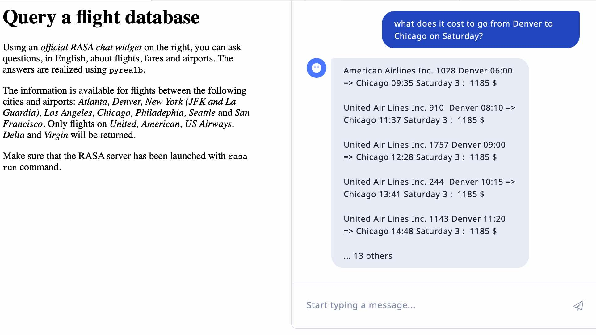

# Question generation of flight information

This demo presents a flight information question-answering system connected to a RASA conversation manager. See the [accompanying text](RASA-INTRO.md) for a quick introduction to the implementation of a conversation bot using RASA. After a few false starts, we decided to build an _NLG server_ using pyrealb as this design choice separates the input parsing from the answer generation.

As examples of questions, we use a version of the [Air Travel Information System (ATIS) corpus](https://catalog.ldc.upenn.edu/docs/LDC93S4B/corpus.html) which was originally collected to develop and evaluate speech systems that understand 
spontaneous speech. The corpus was gathered in a _Wizard of Oz_ experiment in which users were asking about 
flights, fares, airlines, cities, airports, and ground services for which the information was contained in a 
relational database. Given the availability of this corpus, the text part (ignoring the speech aspects, e.g. waveform files) has often been used as test for Natural Language Generation (NLG) experiments to try to reproduce the texts from the meticulous data annotations of the different entities in the text.  Of course, these experiments bypass the important _What to say_ step of NLG, but they allow focusing on the _How to say_ step. 

In order to have a working bot that can answer the questions in a somewhat realistic database, we extracted 
a very small subset of flights between a few airports only on selected airlines. 
The original data is [2015 Flight Delays and Cancellations](https://www.kaggle.com/datasets/usdot/flight-delays) [592 MB]
from which we created the following files:
* `airlines.csv` : only 5 airlines were manually selected from the 14 in the original
* `airports.csv` : only 9 airports were manually selected from the 322 in the original
* `flightDB.json` : created by `selectFlights.py` that picks flights 
operated by the selected airlines departing from and arriving in the selected airports.
Only the first 10 days of January were kept which we consider as sufficient for our small demo.
The selected airlines, airports and flights are combined in a single file `flightDB.json` [1,8 MB]

For example of questions that will be used for training the RASA utterance parser, we use this [version of the dataset](https://github.com/howl-anderson/ATIS_dataset/blob/master/README.en-US.md) slightly modified by `convertJSON.py` so that the roles are indicated as an explicit field instead of being integrated into the entity name.  The departing and arriving airports and the airlines are changed so that only the ones in `flightDB.json` are used. This format is used as output of the RASA 3.0 parser.

The following is an example of a question (there are 893 questions in the test corpus) which associates the`text`, as a list of tokens, with an `intent` (there are 26 different intents) and a list of _typed_ entities with their position in the `text`. 

```javascript
    { "text": "i need a nonstop flight from denver to atlanta",
      "intent": "flight",
      "entities": [
            { "start": 9, "end": 16, "value": "nonstop", "entity": "flight_stop" },
            { "start": 29, "end": 35, "value": "denver", "entity": "city_name", role="fromloc" },
            { "start": 39, "end": 46, "value": "atlanta", "entity": "city_name", role="toloc" }
        ]
    }
```

Before answering the questions, we decided to realize the original questions using `pyrealb`.
Our goal is not to reproduce _verbatim_ the original `text`, but to illustrate how the information about the entities 
can be used to realize well-formed English sentences such as: 

    I need to travel nonstop from Denver to Atlanta. 
    Show a nonstop flight from Denver to Atlanta. 
    Please give a nonstop flight from Denver to Atlanta. 
    List a nonstop flight from Denver to Atlanta. 

We also developed a simple baseline generator using only Python string operations. The above information is then
rendered as:

    show nonstop flights from denver to atlanta

## Organization of the information

An important aspect of a *data to text* system  is the fact that **all the data, and nothing but the data**, should be realized as text. In our case, this means that all `entities` must be _consumed_ once, and only once, when the text is fully rendered. To achieve this, we define a class called `Entities`to manage the list of entities, an entity being itself represented by another class `Entity`. As entities can be repeated we should not use a _dictionary_ of entities.  The following 
method returns a comma separated list of all values associated with a given entity name taking into account an 
optional role. It also removes the found entities from the list. It returns an empty string if the entity is not found.

```python
    def grab_value(self, field:str, role:str=None) -> str:
        res=[]
        i=0
        # cannot use a for loop because the list might be changed during iteration
        while i<len(self.entities):
            if self.entities[i].has_entity_role(field, role):
                res.append(self.entities[i].get_value())
                del self.entities[i]
            else:
                i+=1
        return ", ".join(res)
```
This organization allows checking that all entity values have been realized at the end of the generation process.

## Text generation using `pyrealb` (file `realize_example.py`)

The goal is to transform entities into an internal data structure that can be realized as an English sentence by 
`pyrealb`.  For the first sentence above, this means creating a structure equivalent to the following calls:

```python
    S(Pro("I").pe(1),
      VP(V("need"),
         V("travel").t('b-to'),
         AP(Q("nonstop")),
         PP(P("from"),
            Q("Denver")),
         PP(P("to"),
            Q("Atlanta"))))

```

### `Terminal` realization
`pyrealb` words are instances of the `Terminal` class, so values of entities must be transformed.
The  following function creates a `Terminal` from an entity value guessing its  type from the entity name.

```python
def get_terminal(val:str,entity:str) -> Terminal:
    if entity.endswith("_code"): # upper case for codes
        val=val.upper()
    elif entity.endswith("_name"):  # title case for names
        val=val.title()
    lemma = getLemma(val)  # check lemma type in the dictionary
    if lemma is not None:
        if "N" in lemma: return N(val)
        if "A" in lemma: return A(val)
        if "Adv" in lemma: return Adv(val)
    return Q(val)  # if not found, return a Quoted string
```

### `Phrase` realization
This is used in the following function that is the _basic block_ of most types of realizations. It builds a list of the terminals corresponding to the fields (entity names) appearing in the entities. These terminals are then used as parameters for the `Phrase` constructor given as first parameter. If no matching field names are found then the function returns `None`, a value ignored by `pyrealb` constructors. 

```python
def realize(phrase:Phrase, entities:Entities, fields:list[str], role:str=None)->Constituent:
    res = []
    for f in fields:
        val = entities.grab_value(f, role)
        if len(val)>0:
            res.append(get_terminal(val,f))
    return phrase(*res) if len(res)>0 else None
```

For example, to create a subordinate phrase combining location information from the entities, this function is used as follows:

```python
def realize_loc(phrase:Phrase, entities:Entities, role: str) -> Constituent:
    return realize(phrase, entities,
                   ["city_name", "state_name", "state_code","country_name",
                    "airport_name", "airport_code"],role)
```
which can be called as follows:

``` python
        realize_loc(pp("from"), entities, "fromloc"),
        realize_loc(pp("to"), entities, "toloc"),
        realize_loc(lambda x: VP(V("stop").t("pr"),P("in"),x), entities, "stoploc")
```
to realize the departure and arrival airports with a possible stop in between.

Similar functions are defined for date and time information.

### Common flight information realization

Given the fact that almost all requests need general information about flights such as departure, arrival times and places. The following function return a list of `Phrase` combining the values of the relevant entities. Remember that the realization functions return `None` if no relevant entity is found without calling the `Phrase` constructor.

```python
def realize_common(entities:Entities) -> [Constituent]:
    def date_time(kind,vp):
        if entities.has_role(kind+"_date") or entities.has_role(kind+"_time"):
            return vp([realize_date(entities, kind+"_date"),
                       realize_time(entities, kind+"_time")])
 
    return [
        realize_loc(pp("from"), entities, "fromloc"),
        realize_loc(pp("to"), entities, "toloc"),
        realize_loc(lambda x: VP(V("stop").t("pr"),P("in"),x), entities, "stoploc"),
        date_time("depart",lambda x: VP(V("depart").t("pr"),P("on"),x)),
        date_time("arrive",lambda x: VP(V("arrive").t("pr"),P("at"),x)),
        date_time("return",lambda x: VP(V("return"),x)),
        realize(pp("on"), entities, ["airline_name", "airline_code",
                                     "airport_name", "airport_code",
                                     "aircraft_code",
                                     "flight_number","flight_code"]),
        realize(lambda x: VP(V("serve").t("pr"),x), entities,
                ["city_name","meal","meal_description", "meal_code"]),
        realize(pp("with"),entities,["fare_basis_code"]),
        realize(pp("at"),entities,["airport_name"])
    ]

```

Many of these realization functions use the following _helper_ which creates a prepositional phrase with a given preposition.

```python
def pp(prep:str) -> Callable[[Constituent],Phrase]:
    return lambda *x:PP(P(prep),*x)
```
For example, the resulting of the call to `realize_common` on our running example:

```python
[PP(P("from"),Q("Denver")), PP(P("to"),Q("Atlanta")), None, ...]
```

The list of entities if now left with only the first original element.

### Questions with a specific _intent_ realization

For each intent, we define a function to create an appropriate `pyrealb` expression that can be realized as a sentence.
We only describe here the content of the function for the _flight_ intent which is by far the most frequently encountered, accounting for 74% of all intents in the training corpus. The other 25 intents are dealt similarly.

Even though not necessary in this application, it is often interesting to allow different formulations for a given semantics. `oneOf` is a `pyrealb` function that randomly returns one of its parameters, it is thus convenient to create alternatives when there are no other constraints. As a Python function normally evaluates its parameters before the call, this would imply creating all alternatives before choosing; this is problematic in our case because realization has side effects, namely modifying the list of entities. So in other to delay evaluation of a parameter until it is _selected_, we _wrap_ it in a `lambda` without parameter. Once `oneOf` has chosen an alternative, it checks if it is a `lambda` and if so, it calls the lambda without parameter and returns the results. This _lambda trick_ is not necessary in the case of _simple_ parameters such as strings, (e.g. for choosing in verb below):

```python
    return oneOf(
        lambda: S(oneOf(None,Q("please")),
                  VP(V(oneOf("show","list", "give","find","display")).t("ip"),
                     NP(D("a"),realize(AP, entities, flight_fields)),N("flight")).n(oneOf("s", "p")),
                  realize_common(entities)),
        lambda: S(Pro("I").pe(1),
                  VP(V(oneOf("want","need")), V(oneOf("go","travel")).t("b-to"),
                     realize(AP,entities,flight_fields),
                     realize_common(entities)))
    )
```
#### Baseline generator (file `show_example.py`)

A simplified version of the question realizer using only Python string manipulations was also developed. In this simple use case, this approach seems sufficient for an output without any variation nor capitalization. This type of output is similar in format as the original text and in fact, the BLEU score on the test corpus is higher, thus _better_, with this baseline (42.3) than with the realizer (34.7).

Although the output of the _real_ realizer would most probably be preferred in a production context, the fact that its automatic score is much lower than the baseline is an indication of the limits of these types of scores.

## Answer questions using the flight database

As described in the [File Organization section](#file-organization) in the `Flight Data` directory, we limit the queries to a very small subset of US airports, cities and flights from an existing dataset found in Kaggle in order to create `flightDB.json` which is used for answering the questions according to the _intents_ determined by RASA. 

There are 6,109 flights in the database (between the January 1st and 10th 2015) with the following fields:
```javascript
     {"MONTH": 1,
      "DAY": 1,
      "DAY_OF_WEEK": 4,
      "AIRLINE": "DL",
      "FLIGHT_NUMBER": "2336",
      "ORIGIN_AIRPORT": "DEN",
      "DESTINATION_AIRPORT": "ATL",
      "SCHEDULED_DEPARTURE": "0030",
      "DISTANCE": "1199",
      "SCHEDULED_ARRIVAL": "0523"}
```
Days in the week are coded as Monday=1 through Sunday=7.

Finding and realizing an answer to a question is described in `query_flight_db.py` (in the `RASA_bot/response` directory). When this file is called as a main program, it realizes the answers for all examples in `test.json`. This allows testing the answering process on different intentions. 

Given the information available in the database, only a subset of intentions are dealt with (_flight_, _airfare_, _airline_, _abbreviation_ and _day_name_) which account for the vast majority of cases. Less frequent intents such as _ground_service_, _capacity_, _meal_ are not currently dealt with.  The _distance_ intent is not dealt with, even though there is an intercity distance information in the database,  because most of the questions ask for the distance between an airport and the nearby city, an information that is not available.

Finding flights that satisfy a query is a relatively straightforward process: the list of entities is mapped into a structure similar to the flight information in the database. The essential mapping process is done with the following function to create a dictionary (type `Flight`) with fields such as `origin`, `destination`, `day_name`, etc. The fields `orig_time_rng` and `dest_time_rng` are tuples that define a range of allowed departure or arrival times taking into account loose time specifications such as _morning_ or _evening_ possibly modified with relative time information such as _before_ or _around_,

```python
def extract_flight_infos(entities: Entities) -> Flight:
    infos = {}
    orig_time = {}
    dest_time = {}
    for e in entities:
        value = e.get_value()
        entity = e.get_entity()
        role = e.get_role()
        if entity == "city_name":
            if role == "fromloc":
                infos["origin"] = value
            elif role == "toloc":
                infos["destination"] = value
        elif entity == "airline_name":
            infos["airline"] = value
        elif entity == "flight_number":
            infos["flight_number"] = value
        elif entity == "time_relative":
            infos["time_relative"] = value
        elif role == "depart_time":
            orig_time[entity] = value
        elif role == "arrive_time":
            dest_time[entity] = value
        elif entity == "day_name" and role == "depart_date":
            value = value.lower()
            if value in days_int:
                infos["days"] = days_int[value]
            else:
                print("@@@ unknown day_name:", value)
    infos["orig_time_rng"] = process_time_period(orig_time, infos.get("time_relative"))
    infos["dest_time_rng"] = process_time_period(dest_time, infos.get("time_relative"))
    return infos
```
The flight dictionary is used in the following function which traverses the list of flights and return the flights that match the values of the fields, an unspecified field (denoted by `None`) is ignored.

```python
def find_flights(infos: Flight) -> list[Flight]:
    orig = airport_code(infos.get("origin"))
    dest = airport_code(infos.get("destination"))
    air_code = airline_code(infos.get("airline"))
    ## find matching flights
    res = []
    for flight in flights:
        if all((
                orig is None or orig == flight["ORIGIN_AIRPORT"],
                dest is None or dest == flight["DESTINATION_AIRPORT"],
                air_code is None or air_code == flight["AIRLINE"],
                "flight_number" not in infos or infos["flight_number"] == ["FLIGHT_NUMBER"],
                "orig_time_rng" not in infos or time_match(infos["orig_time_rng"], int(flight["SCHEDULED_DEPARTURE"][0:2])),
                "dest_time_rng" not in infos or time_match(infos["dest_time_rng"], int(flight["SCHEDULED_ARRIVAL"][0:2])),
                "days" not in infos or check_day(flight["DAY_OF_WEEK"], infos["days"])
        )): res.append(flight)
    return res
```

These functions are called from functions dealing with specific intents return list of strings that can either be printed or sent to a RASA process for display. 
Here is the function for the _flight_ intent.
```python
def process_flight(entities: Entities) -> list[str]:
    flights = find_flights(extract_flight_infos(entities))
    return [
        answer_nb_flights(entities, flights),
        *show_flights(flights)
    ]
```

### Implementing a RASA NLG server 

As described in [this document](RASA-INTRO.md), it is possible to define an NLG server that will realize an answer given an intent and entities identified by RASA. `nlg_server.py` shows an example that uses `pyrealb` for sentence realization. The challenging part is the handling of a POST request that retrieves the information from the JSON data associated with the request and builds a reply embedding the text realized by `pyrealb`. 

```python
    def do_POST(self):
        content_length = int(self.headers['Content-Length']) # <--- Gets the size of data
        post_data = self.rfile.read(content_length).decode('utf-8') # <--- Gets the data itself
        fields = json.loads(post_data)
        response = fields["response"]
        message = fields["tracker"]["latest_message"]
        intent = message["intent"]["name"]
        entities = message.get("entities",[]) # fields: entity, value
        text = message.get("text")
        ## answer using pyrealb
        self._set_response()
        self.wfile.write(json.dumps({"text":query_flight_db.process_intent(intent,entities)}).encode("utf-8"))
```

### Launching the RASA bot

**CAUTION**: 
* Because of the need of a special environment (RASA runs only in Python 3.8 or 3.9), it is preferable to test with a copy of the `RASA_bot`
directory in a Python 3.9 virtual environment which includes RASA instead of the version in this directory.  
* As our goal was to show how to show how `pyrealb` could be used as a RASA NLG server, we did not spend time _tuning_ the learning parameters of RASA. This might explain why intent determination is not always _ideal_.

Make sure that there is already a trained model in the RASA_bot directory.

1. `cd RASA_bot`
2. If some examples have changed, run `make_training_data.py` and retrain with `rasa train`  (be patient!)
3. Launch the NLG server with `python3 nlg_server.py`
4. Interact with RASA using one of the following:
   1. the console: `rasa shell` and type questions at the `Your input ->` prompt
   2. the RASA chat widget:
      1. in a console, type `rasa run` wait until `Rasa server is up and running.`
      2. launch a local web server to serve the file `RASA-Client.html` and type questions in the chat box.   
      3. After a few interactions, this could display something like:  

      
## Conclusion

This demo shows a way to use `pyrealb` to realize sentences (both questions and answers) from data in the form of 
entities. It illustrates how `pyrealb` can be used for generating text for a RASA chatbot using an NLG server.

## Contact: [Guy Lapalme](mailto:lapalme@iro.umontreal.ca)

## File organization
* `calculatebleu.py` : compute BLEU score between strings
* `convertJSON.py` : convert original data by adding roles and ensuring that flights only go between _known_ cities
* `Entities_module.py` : Python classes that simplify access to and modification of entities
* `flightDB.json` : current copy of the flight information
* `make_training_data.py` : convert `train.json` into yaml NLU files for RASA, in the `RASA_bot` directory
* `nlg_server.py` : RASA NLG server using `pyrealb`
* `parseExamples.py` : parse all examples from the `{train|test}.json` files and compute statistics, it can be parameterized to ensure that only airlines and cities in `flightDB.json` are used 
* `query_flight_db.py` : use information found by RASA and query the flight database and realize an answer. When called as main, call the answer process on the examples from `test.json`
* `RASA-Client.html` : web page to interact using an _official RASA chat widget_
* `RASA-INTRO.md` : introduction to RASA, relating my own experience and serving as a reminder for a simple use of RASA
* `README.md` : this file
* `realize_example.py` : realize an example using `pyrealb`
* `reproduce_examples.py` : main file to realize all examples both using the string based realizer and the one using `pyrealb`
* `show_example.py` : realize an example using Python string manipulation, mainly concatenation
* `Examples` directory:
  * `train-orig.json`: [original test data ](https://github.com/howl-anderson/ATIS_dataset/blob/master/README.en-US.md)
  * `train.json`: result created by `convertJSON.py`
  * `test-orig.json`: [original test data ](https://github.com/howl-anderson/ATIS_dataset/blob/master/README.en-US.md)
  * `test.json`: result created by `convertJSON.py`
* `Flight Data` directory:
  * Original Directory from [Kaggle](https://www.kaggle.com/datasets/usdot/flight-delays)
  * `selectFlights.py` : create `flightDB.json` by choosing only a few flights
  * `airlines.csv` : selected airlines (done manually)
  * `airports.csv` : selected airports (done manually)
  * `flightDB.json` : selected airlines, airports and flights (should be copied into `RASA_bot/response`)
* `images` : images for Markdown files
* `RASA_BOT` directory with already a few configuration files (use a copy for testing):
  * `actions` directory in which the RASA custom action is defined, the RASA action server should be run in this directory.
  * `data` directory : its content is filled by `make_training_data.py`
  * `models` : trained model with default parameters

