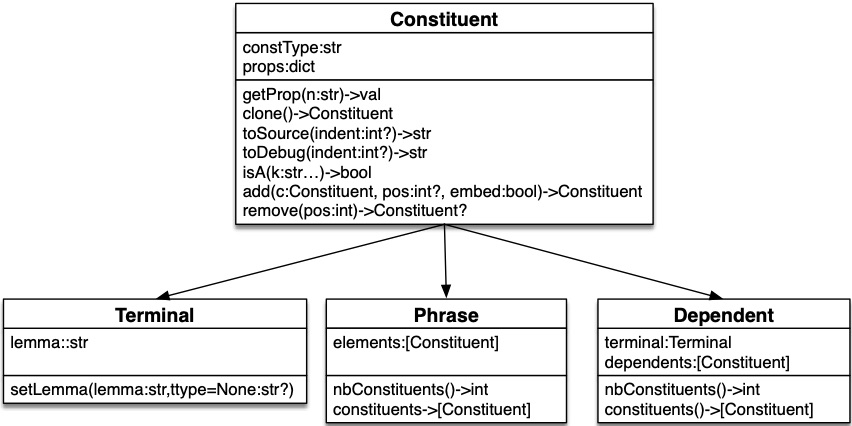

<center style="font-size:3em; font-family: 'Open Sans'; font-weight: bold"><code>pyrealb</code> Hacking</center>
<center><a href="mailto:lapalme@iro.umontreal.ca">Guy Lapalme</a><br/>RALI-DIRO<br/>Université de Montréal<br/>March 2025</center>

[*pyrealb*](https://github.com/lapalme/pyrealb) is a *Python* package which allows English and French sentence realization by programming language instructions that create internal data structures corresponding to the elements of the sentence. This data structure can be built incrementally. When needed, the realization process traverses this structure to produce an output string in the appropriate language. 

*Python* functions build sentence structures from terminals and properly order words within a sentence. They perform the most common agreements between constituents and carry out other useful sentence organization tasks, such as managing coordination or applying sentence transformations. Additionally, it spells out numbers and expresses temporal expressions.

The function names for building syntactic structures were chosen to resemble the symbols typically used in linguistics for constituent syntax trees and for dependency structures. The following code demonstrates two *pyrealb* expressions that are realized as *“He eats apples.” '*  when called as `s.realize()` or `r.realize()`.

```python
# CONSTITUENT notation
s = S(                         # Sentence
      Pro("him").c("nom"),     # Pronoun (citation form), nominative case
      VP(V("eat"),             # Verb at present tense by default
         NP(D("a"),            # Noun Phrase, Determiner
            N("apple").n("p")  # Noun plural
           )       
        )
    )
# DEPENDENCY notation
r = root(V("eat"),                  # Sentence with a verb as head, two dependents
         subj(Pro("him").c("nom")), # Subject with a pronoun as head
         comp(N("apple").n("p"),    # Complement with a noun as head
              det(D("a")))          # dependent with a determiner
    )
```

Previously, examples of *pyrealb* expressions were explicitly written in source programs. However, in some cases, programs can construct or modify these expressions by invoking *Python* functions. It is only when the `.realize()` function is called that realization decisions are made. Occasionally, such as when using negation or passive voice, it requires adding words or altering the sentence’s structure.

This document provides some *tips on how *to dynamically modify `pyrealb` structures.

 *Note*: Although this guide details modifying *pyrealb* expressions, the same princi*ples and methods apply* to *jsRealB,* whose modification API is identical to that of *pyrealb*.

# `Constituent` organization

In order to modify `pyrealb` constituents, it is important to understand  how they are organized. The following table provides the names of the primary classes and *factory* functions that create their instances: 


| Class         | Functions                      |
| ------------- | ------------------------------ |
| `Constituent` |                                |
| `Terminal`    | `N,A,Pro,D,V,Adv,P,C,DT,NO,Q`  |
| `Phrase`      | `NP,AP,VP,AdvP,PP,CP,S,SP`     |
| `Dependent`   | `root,subj,det,comp,mod,coord` |

This diagram depicts a simplified inheritance hierarchy, highlighting the pertinent attributes for structural modification. Each block consists of three components: the class name, the instance variables, and the methods. Additionally, the data types of fields, parameters, and method results are provided. When a value can be `None`, its type is indicated with a question mark.



Internally, [the class structure is more complex, including language-specific classes and auxiliary ones that are not shown here,](./classes-hierarchy.png) as they are not relevant to structural changes.  

# Analyzing an expression

A *pyrealb* expression is a hierarchy of `Constituent` objects, each with a `constType` field indicating its nature and a feature dictionary that drives the generation process. A `Terminal` instance has an additional `lemma` field. Both `Phrase` and `Dependent` objects contain a list of child constituents. A `Dependent` instance also has a field for a `Terminal` that is its head. 

The majority of the modifications involve the creation or deletion of child nodes in `Phrase` or `Dependent`. Typically, properties are altered with options using the dot-notation syntax.

## Type checking

- `isinstance(object, class)`: like any *Python* object, this function can be used for testing if an object is a `Terminal`, a `Phrase` or a `Dependent`.
- `.isA(string,...)` : this method can be used to check if an instance of a `Constituent` is specific `Terminal` (e.g., `N`, `V`...), a `Phrase` (e.g., `NP`, `VP`...) or a `Dependent` (`subj`, `comp`...). If more than one parameter is given, then the function returns `True` if the object is one of specified *kinds*. The parameters are *strings* that are compared with the `constType` field of the object.

## Showing Structure 

- `.toSource(indent=-1)` : returns a string representation of a `Constituent`. If the `indent` parameter is not specified, the string does not contain any newlines.  Here’s what you’ll see when you print the result of `s.toSource()`:

  ```python
  S(Pro("him").c("nom"),VP(V("eat"),NP(D("a"),N("apple").n("p"))))
  ```

  When specified, most often it starts at 0. It indicates the number of spaces to add before each line to better make the structure of the expression stand out.  The following is the result of `print(s.toSource(0))`

  ```python
  S(Pro("him").c("nom"),
    VP(V("eat"),
       NP(D("a"),
          N("apple").n("p"))))
  ```

  The output of `toSource` is a *legal* *pyrealb* expression that could be `eval`ed to recreate the original expression, but it is safer to clone it as explained below.

- `.toDebug(indent=1)` :   this function was developed for the maintainer for checking if the agreement links were correctly set. To appreciate this output, we refer to the details of a *pyrealb*/*jsRealB* structure and of the realization process explained in section 4 of [this](https://arxiv.org/pdf/2012.15425) document. 

  ```json
  S#1-1(Pro#1("him"){"c": "nom"},
        VP#1-1(V#1-1("eat"),
               NP#4(D#4("a"),
                    N#4("apple"){"cnt": "both", "n": "p"})))
  ```

- .`toJSON()` : a `Constituent` can be *converted* a  *Python* `dict` which can then be transformed to a string representing a JSON structure with `json.dumps()`, hence the name of the function.  [This format can be used as input to `jsRealB/pyrealb`](http://rali.iro.umontreal.ca/JSrealB/current/documentation/jsRealB-jsonInput.html) ; it was originally developed to simplify the generation of `pyrealb` expressions from other programming languages.  Here is the output of `pprint(s.toJSON())` where `pprint` is imported from the `pprint` package.

  ```json
  {"elements": [{"lemma": "him", "props": {"c": "nom"}, "terminal": "Pro"},
                {"elements": [{"lemma": "eat", "terminal": "V"},
                              {"elements": [{"lemma": "a", "terminal": "D"},
                                            {"lemma": "apple",
                                             "props": {"cnt": "both", "n": "p"},
                                             "terminal": "N"}],
                               "phrase": "NP"}],
                 "phrase": "VP"}],
   "lang": "en",
   "phrase": "S"}
  ```

## Getting information about a `Constituent`

As with any *Python* object, the value of a field can be obtained with the dotted notation such as `.lemma` or `.terminal`. Changing these values is possible, but it is not recommended due to the potential unintended consequences of direct modification. Instead, use the [documented methods](http://rali.iro.umontreal.ca/JSrealB/current/documentation/user.html?lang=en) to modify these fields. The primary ways to retrieve values are:

- `.getProp(key)`  the value of a property corresponding to a key (a string) including the shared values between `Constituent`s.
- `.nbConstituents()` : the number of `Element`s of a `Phrase` or the number of `Dependent`s of a `Dependent`
- `.constituents()`:. the list of `Element`s of a `Phrase` or the number of `Dependent`s of a `Dependent`

## Cloning a `Constituent`

- `.clone()` : create a copy of a `Constituent`. 

  **Caution**: This method should *always be called before the realization process* that, in some cases, can change the structure of the expression. In the following example, the clone is created after a realization:

  ```python
  s4 = S(Pro("him").c("nom"),
            VP(V("eat"),
               NP(D("a"),
                  N("apple").n("p")))).typ({"pas": True, "neg": True})
  s4.realize()
  print(s4.clone().toSource(0))
  ```

  Its output displays a different structure from the original, because the passivation process swapped the subject and object and the adverb *not* was added because of the negation.

  ```python
  S(NP(D('a'),
       N('apple').n("p")),
    VP(V('be').t("p"),
       Adv('not'),
       V('eat').t("pp"),
       PP(P('by'),
          Pro('him').tn("").g("m").n("s").pe(3)))).typ({"pas":true,"neg":true})
  ```

  In this specific example, the realization could have disabled the passive and negation flags. But the realization process involves many other *subtle* structure modifications, we decided not to touch these flags only for the sake of cloning after realization.

- A **safer** way of creating a copy of an expression is defining a function or a *lambda* with the expression as body and call it when needed so that a fresh copy is created at each call.  For example given the following definition:

  ```python
  sL = lambda: S(Pro("him").c("nom"),
                 VP(V("eat"),
                    NP(D("a"),
                       N("apple").n("p"))))
  ```

  A new structure is created at each `sL()` call.

#  Modifying an expression

Before the final realization, an expression can be modified by adding or removing parts of it. This useful when not all arguments to a phrase are known before starting to build it. For example, its subject and verb can be determined in one part of a program, but its complements only specified later. Coordinated constituents are often built incrementally.

To account for this possibility, `pyrealb` allows adding a new `Constituent` to an existing `Phrase` or a new `Dependent` to another `Dependent` at a given position within its children.  It is also possible to remove a `Constituent`, although this is most often used internally during the realization process.  

As these methods return the modified constituent, calls can be chained as in the following examples. In practice, such calls are seldom encountered because it would have been simpler to create the structure by calling the factory functions. Most often adding or removing constituents is done incrementally in different places during the course of execution of the program.

- for a `Phrase`:

  - `.add(constituent,position=None)`:  insert either a `Phrase` or a `Terminal` to the current `Phrase` at a certain position given by a non-negative index when specified, at the end otherwise. 

    ```python
    s1 = S(Pro("him").c("nom"),
           VP(V("eat"),
              NP(D("a"),N("apple").n("p")).add(A("red")))
           ).add(Adv("now").a(","),0)
    ```

    `s1.realize()` returns *Now, he eats red apples.* The adjective *red* is added at the end of the *NP* but, because adjectives in English are placed before the noun, it is realized before the noun. The adverb *now* followed by comma is inserted at the start of the sentence because the position is set to 0. 

    This can be seen by  the result of the `s1.toSource(0)` call, which corresponds to the modified structure. 
    
    ```python
    S(Adv("now").a(','),
      Pro("him").c("nom"),
      VP(V("eat"),
         NP(D("a"),
            N("apple").n("p"),
            A("red"))))
    ```
    
    
  
    - `.remove(position)`: delete the `Constituent` at a given position within a `Phrase`
  
- For a `Dependent`:

  - `.add(dependent, position=None)`: insert either `Dependent` at a certain position given by a non-negative index when specified, or at the end otherwise. A `Dependent` cannot be created empty; its head, a `Terminal`, must always be specified. To highlight the `.add()` calls, the following *Python* expression is spread across multiple lines:

    ```python
    r1 = root(V("eat"))\
              .add(subj(Pro("him").c("nom")))\
              .add(comp(N("apple").n("p"),
                        det(D("a"))))\
              .add(det(Adv("now").a(",")),0)
    ```

    `r1.realize()` returns *Now, he eats red apples.* The resulting structure shown by `r1.toSource(0)` is the following. 

    ```python
    root(V("eat"),
         det(Adv("now").a(',')),
         subj(Pro("him").c('nom')),
         comp(N("apple").n('p'),
              det(D("a"))))
    ```

    We can see that the last `Dependent` added, which has a position of zero, is now the first dependency. To realize it at the start of the sentence, a `det` `Dependent` was used, but a `subj` would also have been possible. Dependency structures are less position-dependent than constituency structures, so the `position` argument is seldom needed for ’Dependent’s.  In this particular case, the outcome would have been the same had the position not been specified, as `det` or `subj` always occur before the head.

  - `.remove(position)`: delete the `Dependent` at a given position within a `Dependent`

These dynamic modifications explain why most realization decisions in *pyrealb* are made at the very last moment (i.e., when `.realize()` is called), rather than during the structure’s construction. Under the hood, `.add(...)`  is used by `pyrealb` to build constituent expressions. 

## An Alternative to Structure Modifications

Since `pyrealb` expressions are Python objects, they can be easily incorporated into lists or tuples. These structures can then be used as inputs for `pyrealb`’s factory functions, which first flatten the provided lists or tuples before building the underlying structure.  The following example demonstrates how to create the `pyrealb` expression ’s2’, which is functionally equivalent to ’s1’, step by step.

```python
n = [D("a"),N("apple").n("p")]
n.append(A("red"))
vp = (VP(V("eat"),NP(n)))
selems = [Pro("him").c("nom"),vp]
selems.insert(0,Adv("new").a(","))
s2 = S(selems)
```

# Conclusion

This document offered an in-depth guide on modifying `pyrealb` constructs prior to their realization. While the `pyrealb` manual briefly touches on this topic, I believe it could benefit from a more comprehensive and hands-on approach, with some strategies that I have refined over time.

